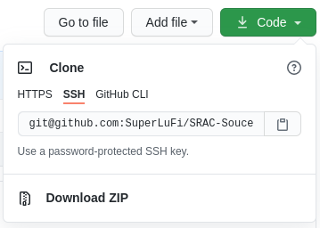

# SRAC-Souce-Code

## Perhatian

Source code program ini merupakan **milik JAEA**. Dilarang menyebarkan, mengedit, dan memproduksi ulang untuk kepentingan komersial. Saya hanya menyimpan program ini sebagai tujuan pembelajaran pada GitHub private repository. Teman hanya boleh mengkloning repositori ini ataupun membagikan link kloning. Dilarang untuk mengunggah ulang ke repositori public.


## Unduh

### Manual

Untuk mengunduh Source Code ini:

Klik "Code" pada bagian kanan atas >> Klik Download Zip




### Melalui perintah **GIT**

Pastikan anda memiliki git.

```bash

sudo apt-get install git

```

Jika git sudah terinstall, eksekusi

```bash

git clone git@github.com:SuperLuFi/SRAC-Souce-Code.git

```

## Instalasi

Setelah mengunduh source code dari repository GitHub. Ekstrak SRAC 2002 atau 2007. Pilih salah satu. Setelah itu gunakan folder SRAC, SRACLIB-JDL32, JDL33. Masuk ke dalam folder dan eksekusi masing-masing file @PunchMe. Mulai dari folder SRAC kemudian Librari JDL manapun.

Detailnya akan diposting web Fisnuk UIN SGD Bandung.

[Fisika Nuklir Reaktor - UIN Bandung](https://superlufi.github.io/)

